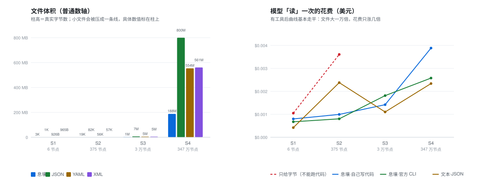

# 格式对比：息壤 vs 文本格式

> **一句话**：同一份数据分别做成息壤、JSON、YAML、XML，用 5 个体量的模型做「读 / 查 / 增 / 改 / 删」和「直接贴进对话」，看到底差在哪。
> **给谁看**：想知道「该不该用息壤」的人。所有数字都是实测，不是估计；测法见文末。



## 速览

| 问题 | 结论 |
|---|---|
| 文件大不大？ | **息壤赢**：数据一大，约只有 JSON 的 **1/4**（347 万节点的库：179 MB vs 800 MB） |
| 模型能不能用？ | **要分清**：不给任何执行环境时只有最强模型能读；**允许它自己写几行代码，9B 模型小文件就能全对** |
| 大文件贵不贵？ | **几乎不涨**：文件从 19 KB 到 179 MB（一万倍），一次「读」的花费只从 $0.0008 涨到 $0.0026 |
| 网页端能用吗？ | **不能**：网页/App 传不了二进制文件，这类界面里息壤基本不可用（除非贴 base64，见问题四） |
| 增删改查呢？ | **基本打平**：查 / 增 / 改值 / 删 都能做对；改名当时的失败是因为 `xr` 还没有 `rename` 命令，**现已补上** |
| 快不快？ | **互有胜负**：小文件文本格式更快，S3 上息壤更快；改一处的引擎代价息壤明显更低 |

一句话：**息壤的强项是「小」和「结构」，不是「打开就能读」**。

## 问题一：增删改查效率怎么样？

**结论**：工具齐备时，**查 / 增 / 改值 / 删 都能做对**；「改名」当时因为息壤没有这个命令而失败，**该命令现已补上**。

> 这张表是 2026-09-22 测的。当时**息壤还没有改名命令**（实验里模型的分数因此是 0——它在猜 `xr delete`、`xr save` 这些不存在的命令），那一栏对息壤不公平。该命令随后已经补上：`xr rename <file> <节点ID> <新名字>`，编号不变、引用不断。表里的数字保留为当时的实测，不做修改。

> **分数是怎么来的？** 每个格子让同一个模型跑 3 次，取最好的一次，所以分数只有 0 到 1。判分很机械，不看模型的措辞：
>
> - **读**＝事实召回率。先从真值里列出这个文件所有「节点名 + 非空的值」当事实清单（S1 有 8 条，S2 有 355 条；S3/S4 太大，改成只取**开头 200 个节点**），再看模型的答案里出现了多少条，命中数 ÷ 总数。答对一半就是 0.50。
> - **查**＝标准答案有没有出现在回答里，出现算 1，没出现算 0。
> - **增 / 改值 / 改名 / 删**＝改完之后**把文件重新读回来**，核对改动是不是真的落在目标节点上（息壤还会再跑一遍 `xr validate`），对 1、错 0。

S1（6 节点，最好成绩，best-of-3）：

| 组 | 读 | 查 | 增（加子节点） | 改值 | 改名 | 删 |
|---|---|---|---|---|---|---|
| 息壤·自己写代码 | 1.00 | 1.00 | 1.00 | 0.00 | 0.00 | 0.00 |
| 息壤·官方 CLI | 1.00 | 1.00 | 1.00 | **1.00** | **0.00** | 1.00 |
| 文本·JSON | 1.00 | 1.00 | 1.00 | 1.00 | 1.00 | 1.00 |

S2（375 节点）：

| 组 | 读 | 查 | 增 | 改值 | 改名 | 删 |
|---|---|---|---|---|---|---|
| 息壤·自己写代码 | 0.37 | 1.00 | 1.00 | 1.00 | 1.00 | 0.00 |
| 息壤·官方 CLI | 0.50 | 1.00 | 1.00 | 1.00 | **0.00** | 1.00 |
| 文本·JSON | 0.38 | 1.00 | 1.00 | 1.00 | 1.00 | 1.00 |

- **「读」为什么到不了 1.00？** 因为这一列要求把**全部**节点吐出来：S1 只有 6 个节点，谁都能拿 1.00；S2 有 375 个节点、355 条事实，模型的单次回答会被长度上限截断，于是谁都上不去——**三种格式一样低**（文本·JSON 在 S2 也只有 0.38，在 S1 也是 1.00）。所以这是**任务本身的容量问题，不是息壤的问题**。正因如此，S3/S4 才把题目换成「只还原开头 200 个节点」。
- 息壤「自己写代码」那一列的 0，是模型要手工改二进制字节，太难；用官方 CLI 就正常了。
- 当时 `xr` 缺一个 `rename` 命令（核心库 `Store::rename` 早就有了，只是没接到命令行上），所以「改名」那一栏息壤是 0。**该命令现已补上**，重跑的话这一栏不会再是 0。

**改一处的引擎代价**（与模型无关，纯写入耗时）。这一项**不能只看一列**——文本格式有好几条路，而息壤只有一条：

| 做法 | S3（JSON 6.8 MB / 息壤 1.36 MB） | S4（JSON 800 MB / 息壤 179 MB） |
|---|---|---|
| 息壤：只能**整份重写** | 0.01 s | **3.1 s** |
| JSON：解析 → 改 → 重新序列化（脚本里最常见的写法） | 0.13 s | 17.8 s |
| JSON：**就地改**（长度不变，找到位置直接覆写） | 定位 0.005 s + 写入 0.0001 s | 定位 0.94 s + 写入 0.0003 s |
| JSON：字节级替换但**长度变了**（后面要整体挪） | 0.00 s | 0.74 s |

所以回答「JSON 改一个字符要不要重写整个文件」：**不一定要**。拿文本编辑器改一个同样长度的值，几乎不花时间；就算长度变了，字节级替换也只是「读一遍 + 写一遍」。

息壤这边**没有「就地改」这条路**——它是按偏移紧密排列的二进制，改一个字符就可能让后面全部错位，所以只能整份重写。它唯一的优势是**文件小**：同样是「整份重写」，S4 上 3.1 s vs 17.8 s，快约 6 倍。（要更快得上[分片词库](../spec/协议.md)，只重写被改到的那一片。）

## 问题二：省不省空间、省不省时间？

**结论**：**空间明确省**（数据一大就是 1/4）；**时间互有胜负**，没有一边倒。

| 数据 | 息壤 | JSON | YAML | XML |
|---|---|---|---|---|
| S1 · 6 节点 | 2.8 KB | 1.4 KB | 0.9 KB | 1.0 KB |
| S2 · 375 节点 | **19 KB** | 82 KB | 56 KB | 57 KB |
| S3 · 3 万节点 | **1.36 MB** | 6.78 MB | 4.60 MB | 4.66 MB |
| S4 · 347 万节点 | **179 MB** | 800 MB | 554 MB | 561 MB |

注意第一行是**反例**：6 个节点的小文件里，2.4 KB 是自描述的英文文件头，节点本身只有几百字节——所以文件越小，息壤越吃亏。文件头是「用体积换零提示可读」的固定开销。

时间（每个模型完成一次「读」的中位耗时）：

| 组 | S1 | S2 | S3 | S4 |
|---|---|---|---|---|
| 息壤·自己写代码 | 46 s | 33 s | 60 s | 973 s |
| 息壤·官方 CLI | 40 s | 47 s | 80 s | 335 s |
| 文本·JSON | **18 s** | 40 s | **41 s** | **145 s** |

小文件是文本格式快（不用写解析器），S2 上息壤略快，S4 上文本格式又快回来（模型直接读文件头就能拿到前 200 个节点）。

花费与 token（每个模型完成一次「读」的中位数）：

| 组 | | S1 | S2 | S3 | S4 |
|---|---|---|---|---|---|
| 只给字节 |花费 | $0.0010 | $0.0036 | 不可测 | 不可测 |
| | 输入 token | 5,575 | **33,973** | — | — |
| 息壤·自己写代码 | 花费 | $0.0008 | $0.0010 | $0.0014 | $0.0039 |
| | 输入 token | 13,831 | 16,598 | 8,056 | 24,667 |
| 息壤·官方 CLI | 花费 | $0.0007 | $0.0008 | $0.0018 | **$0.0026** |
| | 输入 token | 7,305 | 11,228 | 14,039 | 9,626 |
| 文本·JSON | 花费 | **$0.0004** | $0.0024 | **$0.0011** | $0.0023 |
| | 输入 token | 3,028 | 22,102 | 11,517 | 13,951 |

这张表里最值得看的是**纵向**：**有了工具之后，花费和 token 几乎不随文件变大而增长**（S4 比 S2 大一万倍，CLI 组的花费只从 $0.0008 到 $0.0026），因为模型是按需查、不是整份读。而「只给字节」是**整份贴进去**，成本随体积线性涨——所以它只能用于小文件。

### 读取耗时：文本格式明显更快，息壤怎么追？

上表里文本·JSON 的中位耗时在 S1（18 s）、S3（41 s）、S4（145 s）都更快。原因很直白：**文本格式模型打开就能读**，息壤得先「学会用工具」或者「写一个解析器」，这一步是纯开销。

从这次实验里能看到几条明确的优化方向（前两条已经落地）：

1. **把工具的存在和用法喂到模型眼前。**（已做）S4 上息壤 CLI 组失败的格子，模型猜的是 `xr cat`、`xr get`、`xr save` 这些**不存在的命令**——它没意识到有 `xr tree`。现在 Skill 与 MCP 的工具说明里都写明了「大文件别整棵 dump，先取前 N 个节点」。**没有**把提示写进文件头：头文本按既定原则只描述「怎么解析」，不做工具宣传（那正是早期实验刻意删掉的）。
2. **给「只看一部分」的小命令。**（已做）`xr tree --head 200`（限条数）、`xr tree --depth 2`（限层数）、`xr cat --head 200`（扁平视图），MCP 侧对应 `head_nodes` 工具——不用再让模型自己拼管道，也顺带给了人一个「像看文本一样浏览」的入口（终端下自动分页）。
3. **文件头同时给「说明」和「一小段解析代码」。** 早期 A/B 测试发现模型口味分裂：有的吃纯文本描述，有的看到代码才会动手。双写能让两类模型都快起来。
4. **把「读」交给查看器，而不是让模型读。** 人用查看器打开、复制出需要的部分再给模型，模型完全跳过一次解析——这也是下面要做的查看器为什么重要。

## 问题三：对用户方便吗？

**结论**：**看场景**——随手看一眼、手改一个值，文本格式方便得多；要长期存、要跨文件关联，息壤更方便。这一节没有数字，只有「能不能做」。

| 事情 | 文本格式（JSON 等） | 息壤 |
|---|---|---|
| 打开就能看 | ✅ 记事本就够了 | ❌ 二进制，**必须有查看器**（这正是要补的东西） |
| 手工改一个值 | ✅ 改完就行 | ❌ 不能手改，必须走工具 |
| 装什么 | 什么都不用装 | 要装 `xr`，或一个查看器 |
| 编辑器支持 | ✅ 高亮、折叠、校验一堆现成 | ❌ 基本没有 |
| 压缩/传输 | 大 | ✅ 小 3–4 倍 |
| 跨文件关联 | ❌ 得自己约定 id | ✅ 编号全局唯一 + 本机目录 |
| 数据坏了怎么办 | 靠 JSON 解析器报错 | ✅ `xr validate` 报错码（见问题五） |

一句要说公道话的：「记事本也能看 JSON」听起来免费，但**记事本本身就是软件**——文本格式真正的优势不是「不需要工具」，而是**工具满地都是**，随便哪个编辑器、哪门语言都自带。息壤现在缺的是这个生态。

所以对我们来说，**做一个顺手的息壤查看器不是锦上添花，而是必需品**。而且它不该只有树状图一种样子：树视图适合看结构，但大多数人第一次上手需要的是**熟悉的纯文本外观**——像系统自带的文本编辑器那样，一屏一行、可以滚、可以搜、可以复制，只不过每行是「节点名 = 值」而不是原始 JSON。两种视图给同一份数据，用户想怎么看看就怎么看。

## 问题四：给大模型用方便吗（API / 网页端）？

**结论**：**分两种用法，结论相反。**

1. **网页版 / App（ChatGPT、Claude 网页等）**：**息壤基本不可用**。那些界面只能传文本，传不了 `.xirang` 二进制文件。文本格式可以直接粘贴。
2. **走 API（或允许模型读写文件）**：可用，而且**更省 token**——但「直接贴」这条路息壤明显更差。

把内容**直接贴进对话**（不给文件、不许跑代码）的实测：

| 贴什么 | 档 | 读（还原） | 查 | 输入 token | 花费 | 耗时 |
|---|---|---|---|---|---|---|
| JSON | S1 | 1.00 | 1.00 | 762 | $0.0002 | 16 s |
| YAML | S1 | 1.00 | 1.00 | 624 | $0.0001 | 15 s |
| XML | S1 | 1.00 | 1.00 | 597 | $0.0002 | 17 s |
| 息壤（base64） | S1 | **0.00** | 1.00 | 2,343 | $0.0005 | 54 s |
| JSON | S2 | 1.00 | 1.00 | 34,051 | $0.0051 | 212 s |
| YAML | S2 | 1.00 | 1.00 | 35,754 | $0.0016 | 213 s |
| XML | S2 | 1.00 | 1.00 | 33,306 | $0.0034 | 186 s |
| 息壤（base64） | S2 | **0.48** | 1.00 | **16,970** | $0.0020 | 116 s |

- 息壤转成 base64 贴进去，**token 只有 JSON 的一半**（S2：1.7 万 vs 3.4 万）；
- 但**模型读不准**：大文件只还原出 48% 的事实，小文件因为要先解 base64、再逐字节解析，直接 0 分。
- 也就是说：**「贴文本」这条路，文本格式赢**；息壤要发挥长处，必须让模型能读文件或调用工具。

## 问题五：还有哪些别处没有的优势、哪些劣势？

这些不是数字，是「有 / 没有」和一条可复现的演示。

| 能力 | 文本格式 | 息壤 | 说明 |
|---|---|---|---|
| 加字段不用改解析器 | 一般 | ✅ | 息壤里任何属性都是一个普通子节点，加多少都不用改代码，也没有 schema 要同步 |
| 跨文件引用 | ❌ | ✅ | 节点编号全局唯一，`xr ws` 能把跨文件的同一节点连起来（JSON 里就是你自己的字符串约定） |
| 断裂检测 | ❌ | ✅ | 见下面的演示 |
| 身份稳定 | ❌ | ✅ | 编号是 UUID，改名、改值都不影响引用；JSON 里通常是靠「名字」或数组下标，改一下就断 |
| 生态与工具 | ✅ 到处都是 | ❌ 得自己带 | 任何语言、任何编辑器都认识 JSON |

断裂检测的演示（构造一个引用指向不存在的节点）：

```
$ xr validate 断链.xirang
R001 <127289ea…> 引用断裂：目标 21d6b0d8-a058-416c-b494-1878c0215d41 不存在
共 1 个错误          # 退出码 1
```

息壤还另有结构类错误码（E001 编号缺失、E006 父节点成环等）。JSON 里删掉一个被引用的对象，不会有任何东西告诉你。

## 怎么测的

- **四个测试组**：① 只给字节（不能跑代码）② 文本格式 ③ 息壤·自己写代码（不给 `xr`，模型自己写 Python）④ 息壤·带官方 CLI。另加 ⑤ **直接贴内容**（不给文件、不许跑代码）。
- **四档规模**：6 节点 2.8 KB → 375 节点 19 KB → 3 万节点 1.36 MB → 347 万节点 179 MB（都是真实词库；小档是历史真值树）。
- **任务**：读全、查一条（某节点的父节点是谁）、增（加子节点）、改值、改名、删（叶子节点）。
- **模型**：5 个体量档各一个——`ministral-3b`(3B)、`qwen3.5-9b`(9B)、`gemma-3-12b`、`gemma-3-27b`、`deepseek-v4-flash`，都是价格闸门内的便宜模型。每格跑 3 次取最好。
- **判分**：读＝还原出来的节点名/值的事实召回率；查＝精确比对；增/改/删＝改完把文件读回来，确认改动真的落在目标节点上（还会跑一遍 `xr validate`）。
- **跑在哪**：一台 10 核 / 16 GB 的 Mac，无人值守跑完，调用模型 API。共 **1176 个格子，总花费 $1.90**。

## 别误读

- **模型只覆盖 5 个限价档**，claude / kimi / grok 这些贵模型没测；价钱敏感的地方我们已经刻意挑了便宜的。
- **大档做了分层**：S3 用 5 个模型、S4 只用 2 个；文本格式在 S3 / S4 只做 JSON 对照；S4 的部分格子是单次而非 3 次（179 MB 上一轮会话要十几分钟）。
- **S4 上息壤的成绩别当反例**：模型并没有用「`xr tree | head`」这种最省事的做法，那个 0.03 更像「模型没用好工具」，不等于「息壤读不了大文件」。
- **「改名」那一栏是旧数据**：测的时候 `xr` 还没有改名命令，那是工具的锅不是格式的锅；命令已经补上（`xr rename`），但表里的分数没重跑。
- 模型版本会变，数字也会变；要复现请重新跑。
